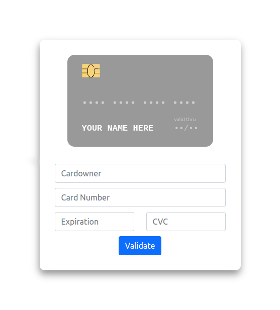
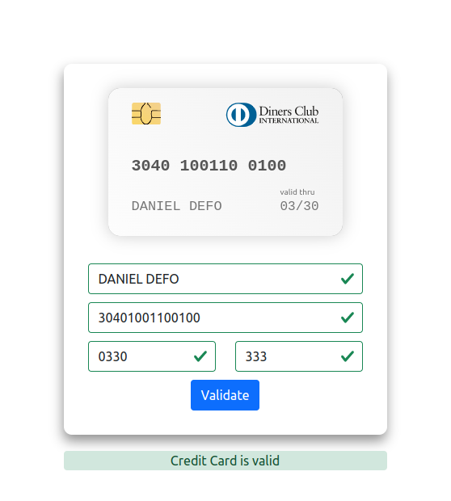
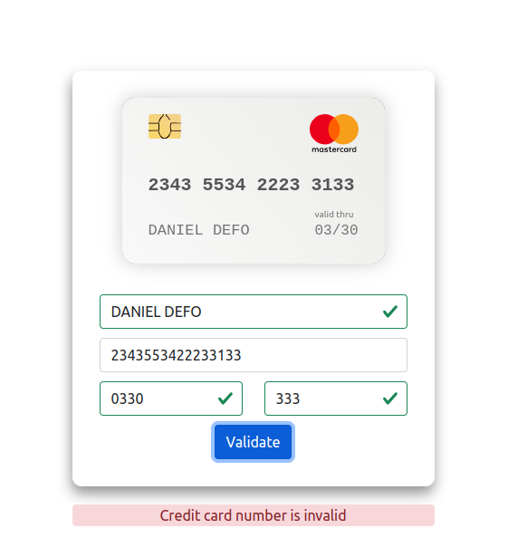
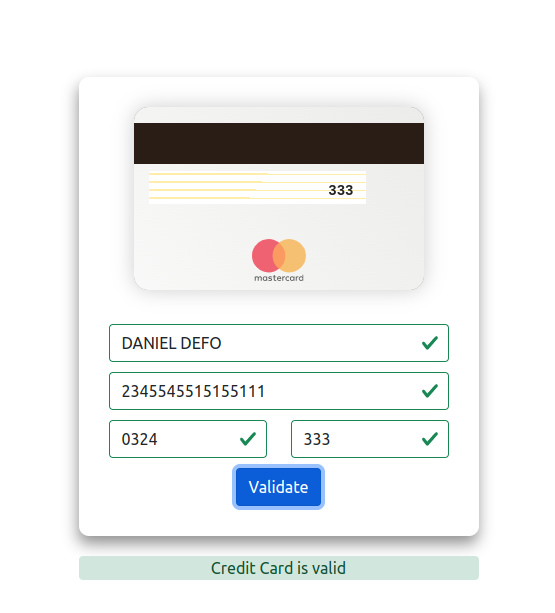

# Card Validator

## Task:
Make a small application that will allow the user to check the validity of a credit card. The validation must apply to every field of the input. NAME / EXPIRY DATE / CARD NUMBER / SECRET CODE. And it would also not be bad to recognize VISA / MASTERCARD, etc.

## Result

#### Main

#### Card type and validation 

#### Card invalid number example

#### Card CVC side and validation

## Used technology

##### React / react-bootstrap / card-validator / react-credit-cards